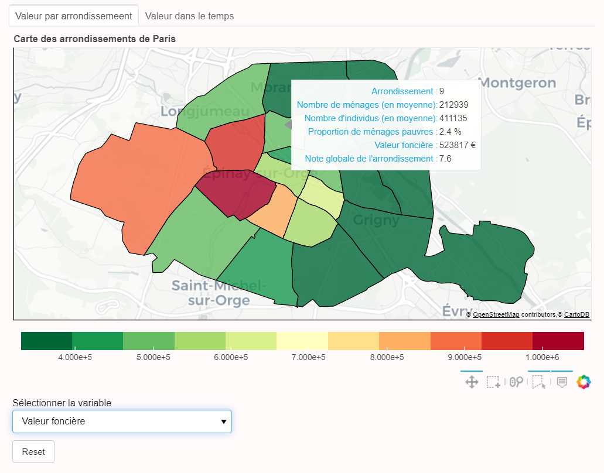
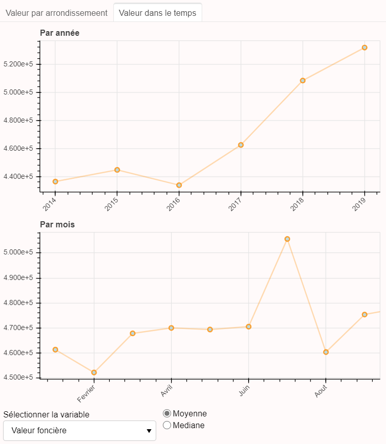

<h1 align="center">:house: Prévision du prix de l'immobilier parisien à l'aide de DVF &Co :house:</h1>

  <strong>Projet Python 2ème année de l'ENSAE</strong>

  <strong>La présentation du projet est <a href="https://github.com/camillefrancon">disponible ici</a></strong>

  En collaboration avec 
  <a href="https://github.com/camillefrancon">Camille Francon</a>,
  <a href="https://github.com/Orlogskapten">Wenceslas Sanchez</a> et
    <a href="https://github.com/khaledlarbi">Khaled Larbi</a>.

## Sommaire
- [But](#but)
- [Résultats](#résultats)
- [GitHub-Pages](#github-pages)

----
Les données sont [disponibles ici temporairement](https://drive.google.com/drive/folders/1jNVEkmhRgsNgsXHlyKPRbNdJiBnFMHr_?usp=sharing).

## But

La direction générale des finances publiques publie tous les semestres le dataset **Demandes de valeurs foncières** qui fournit sur les 5 dernières années l'ensemble des transactions immobilières à partir des actes notariés sur le territoire métropolitain (hors Alsace, Moselle et Mayotte). Ce dataset contient la valeur à laquelle le bien a été vendu, le type de transaction, les caractéristiques des biens (surface, localisation, nombre de pièce) etc. Les données sont accessibles [ici](https://datafoncier.cerema.fr/donnees/autres-donnees-foncieres/dvfplus-open-data);

Nous nous sommes concentrés sur Paris (en dépit d'avoir 64 go de RAM :cry:) pour prédire la valeur d'un bien (en fonction de ses caractéristiques) en enrichissant le dataset avec :
- les données **FiLoSoFi** publié par l'INSEE qui fournissent des informations sur les caractéristiques des ménages au sein d'un carroyage (de 200m pour notre part), disponible [ici](https://www.data.gouv.fr/fr/datasets/donnees-carroyees-issues-du-dispositif-sur-les-revenus-localises-fiscaux-et-sociaux-filosofi/).
- les critères d'appréciation et **les notes de Paris** par arrondissement (noté par les habitants). Ces informations ont été scrappé sur le site [Ville-idéale](https://www.ville-ideale.fr/). Le script qui permet de scrapper est disponilbe [ici](https://github.com/Orlogskapten/dvf_ensae_sbra/blob/master/script/ville_ideale_scraping.py)
- les données sur **les équipements à proximité des logements**. Le dataset est disponible [ici](https://www.insee.fr/fr/statistiques/fichier/3568638/bpe19_ensemble_xy_csv.zip). Un gros travail a été nécessaire pour rattacher ces données à la table DVF que vous retrouverez [ici](https://github.com/Orlogskapten/dvf_ensae_sbra/blob/master/khaled/notebook/localisation_service_bpe.ipynb).

## Résultats

| Modèle |      RMSE     | Gagnant |
|:----:|:----------------:|:----:|
| LightGBM |      140786.01      | :crown: |
| SVR |    205309.53   | :cry: |
| RandomForest |    143325.41   | :cry: |

## GitHub-Pages

Nous avons développé dans le cadre de ce projet **un dashboard intéractif** pour mettre en avant les principales variables disponibles dans notre dataset dont voici un aperçu :

  

  

Il est disponible sur [cette page](https://orlogskapten.github.io/dvf_ensae_sbra/#dashboard) et en app [ici](https://parismutation.herokuapp.com/).
